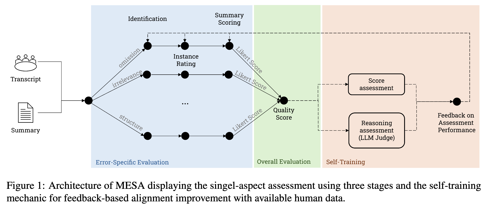
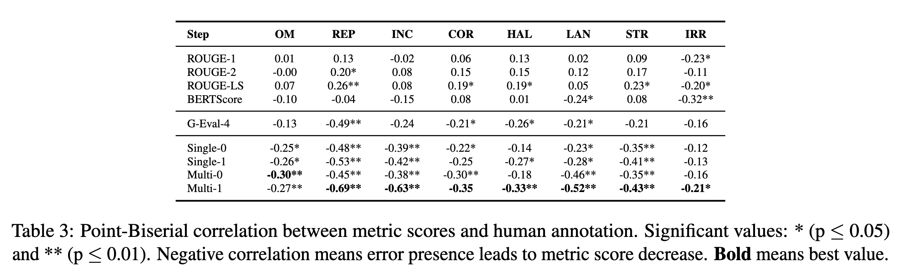
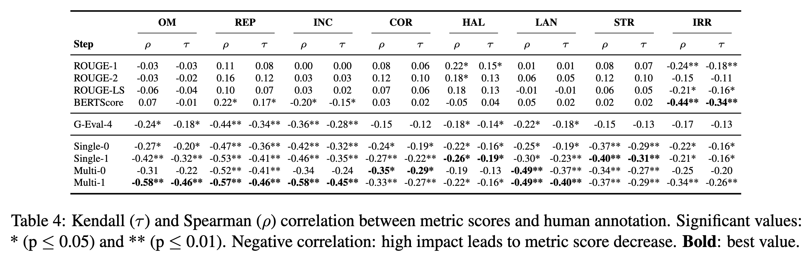
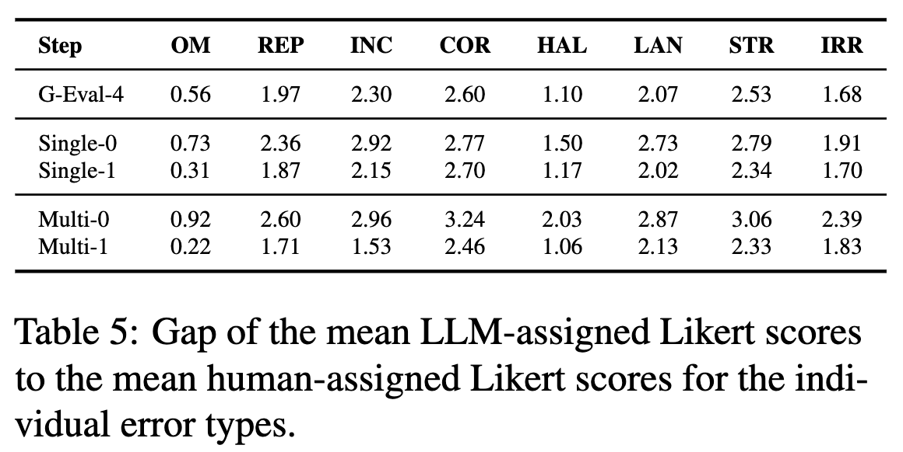

# Is my Meeting Summary Good? Estimating Quality with a Multi-LLM Evaluator
This software project accompanies the research paper, [Is my Meeting Summary Good? Estimating Quality with a Multi-LLM Evaluator](https://arxiv.org/abs/2411.18444). **This paper has been accepted to COLING 2025 Industry Track.**


## Content of the work
Current meeting summary evaluation is insufficient. Metrics like ROUGE and BERTScore do not align well with human judgment, especially for spoken content.
These traditional metrics miss context-specific errors and fail to display the severity of each mistake, leading to misleading quality scores.
Lately, LLMs can provide more nuanced ratings based on guidelines, going beyond simple word overlap.
However, LLM-based metrics are still error prone for the meeting summarization context:
- Error definitions can be subtle (e.g., hallucination vs. omission). When LLMs try to judge multiple error types in one pass, definitions can get mixed or oversimplified.
- A single-step assessment may skip certain (minor) error instances, reducing scoring accuracy.
- LLM responses can vary, introducing fluctuation in scoring and making it hard to rely on a single round of assessment.

We present MESA (MEeting Summary Assessor architectur)

<p align="center">

</p>

## Results

**MESA shows strong correlation with human judgment, masking fewer errors**
<p align="center">

</p>

- *Higher Correlations:* LLM-based methods align more closely with human assessments, suggesting they more accurately penalize errors.
- *Issues of other LLM-based approaches:* They are prone to missing error instances, leading to inaccurate evaluation behavior.
- *MESA’s Advantage:* Splitting the evaluation into “detection” and “scoring” phases outperforms prior evaluation methods across multiple error types.
Incoherence, Language, and Irrelevance benefit most, while Omission and Hallucination remain challenging.
- *Self-Training Boost:* Self-training refines the model’s focus on identified error instances, leading to even better correlation by catching overlooked cases and reducing false positives.


**Per-error ratings capture error severity more accurately.**

<p align="center">

</p>

- *Traditional Metrics Fall Short:* ROUGE and BERTScore handle certain errors (e.g., Irrelevance) fairly well but struggle with others, rewarding or penalizing them inconsistently (e.g., Repetition, Hallucination).
- *MESA’s Multi-Step Edge:* By explicitly identifying and scoring each error, MESA yields a richer understanding of how severe an error is.
- *Impact of Multi-Agent Discussion:* Discussion further enhances the analysis, leading to better categorization of subtle or high-impact errors.


**Self-teaching narrows overestimation of error impact**

<p align="center">

</p>

- *Initial Gap:* MESA at first can assign higher severity scores than human annotators do, likely due to the more thorough error detection.
- *Self-Teaching Correction:* Incorporating the model’s own feedback loop reduces this gap, aligning scores more closely with human judgment.

## Run the project
run src/mesa.py

## Citation
```
@inproceedings{kirstein-etal-2025a,
    title = "Is my Meeting Summary Good? Estimating Quality with a Multi-LLM Evaluator",
    author = "Kirstein, Frederic  and
      Ruas, Terry  and
      Gipp, Bela",
    year = "2025",
    month = jan,
    booktitle = {Proceedings of the 31th International Conference on Computational
Linguistics: Industry Track},
    publisher = {International Committee on Computational Linguistics},
    address = {Abu Dhabi, the United Arab Emirates},
}
```
